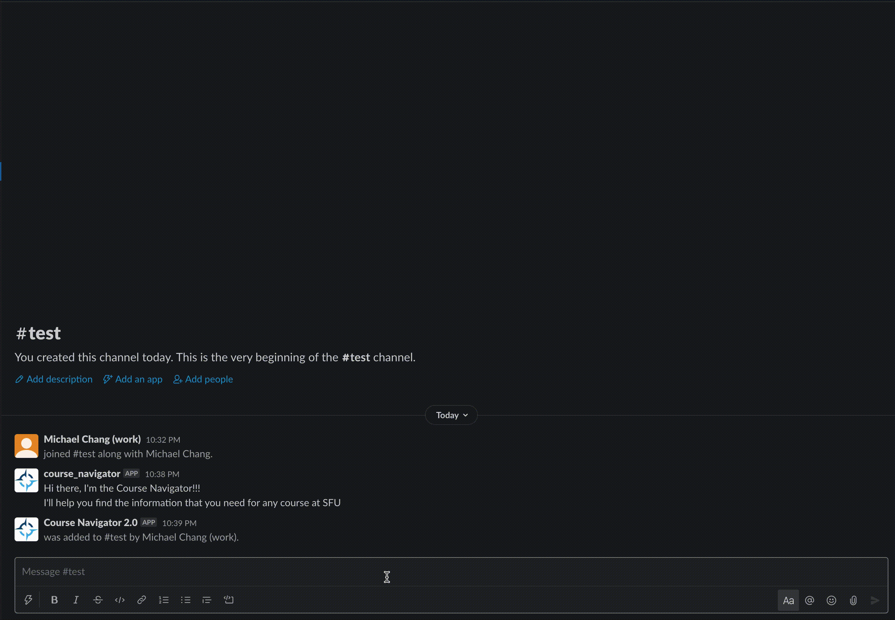

#  Course Navigator Slack

This project is influenced and inspired by the SFU Surge's project [Degree Navigator](https://github.com/AmirNaghibi/DegreeNavigator)

[Checkout their website here](https://amirnaghibi.github.io/DegreeNavigator/)

Course Navigator is a Slack bot that can help you find information for every SFU course and present them to the user in an interactive way.

[Checkout the Discord version](https://github.com/engichang1467/CourseNavigator)

## The demo

